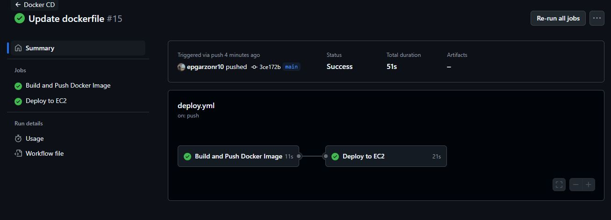
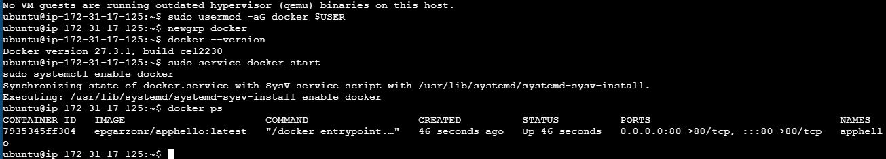
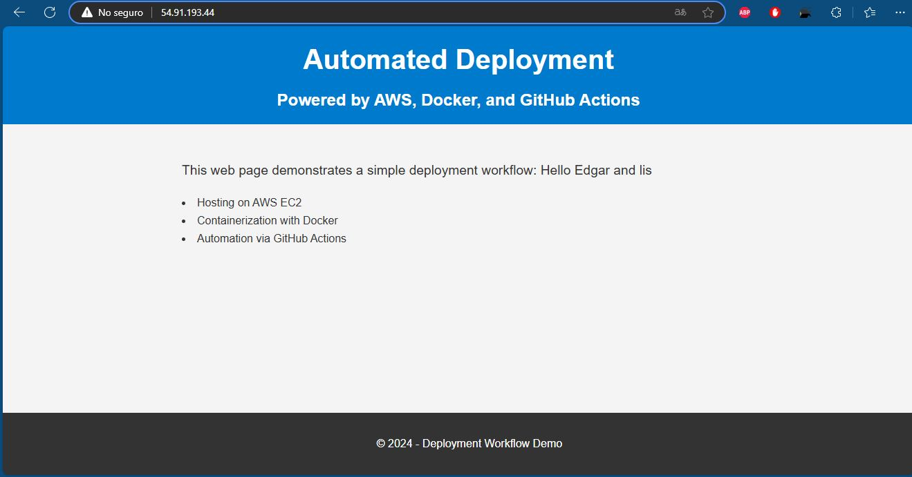
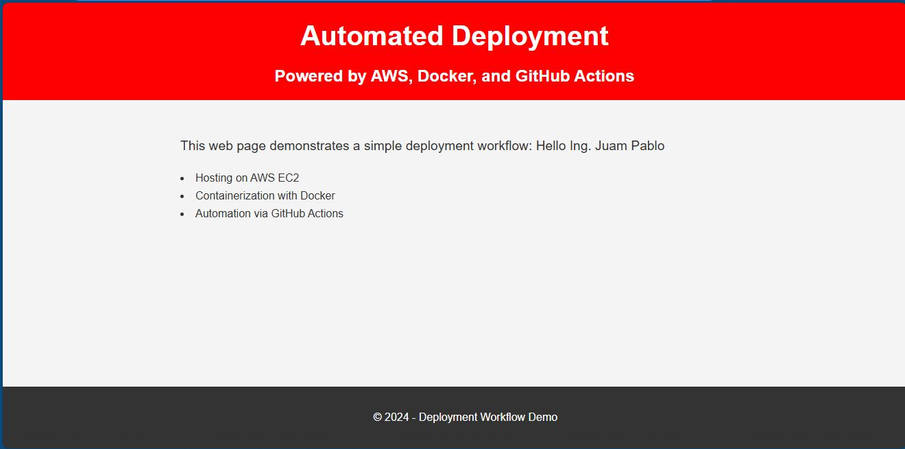

# AWS Deployment with Docker and GitHub Actions 💻

This project demonstrates a **continuous deployment workflow** to an AWS EC2 instance using **Docker** for containerization and **GitHub Actions** for automation. The deployed application is a static website served by **Nginx**.

---

## Features 🔥
- **Automated Builds**: GitHub Actions automates the build and push process for Docker images.
- **Containerization**: Packages the application into a lightweight Docker container.
- **AWS Deployment**: Automates the deployment to an AWS EC2 instance.
- **Continuous Deployment**: Ensures any changes pushed to the repository are live immediately.

---

## Project Structure 🛠️

```bash
.
├── .github/
│   └── workflows/
│       └── aws_deploy.yml      # GitHub Actions workflow file for deployment
├── index.html                  # Main HTML file for the project
├── styles.css                  # CSS file for styling the HTML page
├── Dockerfile                  # Dockerfile to containerize the project
└── README.md                   # Documentation for the project

```
## Workflow Explanation

1. **Build and Push Docker Image 📦**:
   - When code is pushed to the `main` branch, the workflow:
     - Checks out the code.
     - Builds a Docker image using the `Dockerfile`.
     - Pushes the image to Docker Hub.

2. **Deploy to AWS 🚀**:
   - SSHs into an AWS EC2 instance.
   - Installs Docker (if not already installed).
   - Pulls the latest Docker image from Docker Hub.
   - Runs the container, exposing it on port `80`.

### Explanation ⚙️:

This `README.md` provides a detailed description of the `Dockerfile` and its role in the deployment pipeline. It breaks down each command used in the `Dockerfile` and explains how they contribute to containerizing the web application. Additionally, it explains how the Docker image is used in the GitHub Actions workflow for automated deployment to AWS.

# Continuous Deployment with GitHub Actions:Results of the Automated Deployment Flow 🚀

This section describes the automated deployment process and how changes pushed to the `main` branch trigger GitHub Actions to deploy the latest version of your app to an AWS EC2 instance.

---

## Step 1: **Triggering the Workflow on GitHub Actions 📈**

Once you push changes to the `main` branch, the **GitHub Actions** workflow is automatically triggered. Here’s an example of how the workflow runs:

1. **GitHub Actions Workflow Execution**: The `aws_deploy.yml` file in `.github/workflows/` gets executed.
2. **Build Docker Image**: The Docker image is built and pushed to Docker Hub.
3. **Deploy to EC2**: The image is pulled on your AWS EC2 instance, and the application is deployed.

#### GitHub Actions Results Screenshot 📊
This is a snapshot showing the workflow execution on **GitHub Actions**:



---

## Step 2: **Deploying to EC2 🖥️**

After the Docker image is pushed to Docker Hub, **GitHub Actions** SSHs into the AWS EC2 instance and runs the following steps:

1. **Install Docker** (if not installed).
2. **Pull Latest Image from Docker Hub**.
3. **Run the Docker Container**.

The container is then started on the EC2 instance, exposing the app on **port 80**.

#### EC2 Instance Screenshot 💻
Here’s an image showing the **EC2 instance** where the Docker container is running:



---

## Step 3: **Access the Deployed Website 🌍**

Once the Docker container is up and running, you can access the website using the **public IP address** of the EC2 instance. This is the deployed web application served by **Nginx**.

#### Deployed Website Screenshot 🌐
This is how the **deployed website** looks once it's live on AWS:



---

## Step 4: **Making Changes and Triggering Continuous Deployment 🔄**

Now, suppose you make changes to the `index.html` or `styles.css` files. Once you push the changes to the `main` branch, the **GitHub Actions** workflow will be triggered again, and the updated Docker image will be deployed to AWS.

### Example of Making Changes:
Let's say you change the text or style on the webpage and commit it.

**Git Commit Example:**

```bash
git add .
git commit -m "Update the homepage content"
git push
```
Once you push, the GitHub Actions workflow kicks off again.

### GitHub Actions Workflow Update 🔄
Here’s a snapshot of the workflow running again, confirming the successful update and deployment of the new image:
